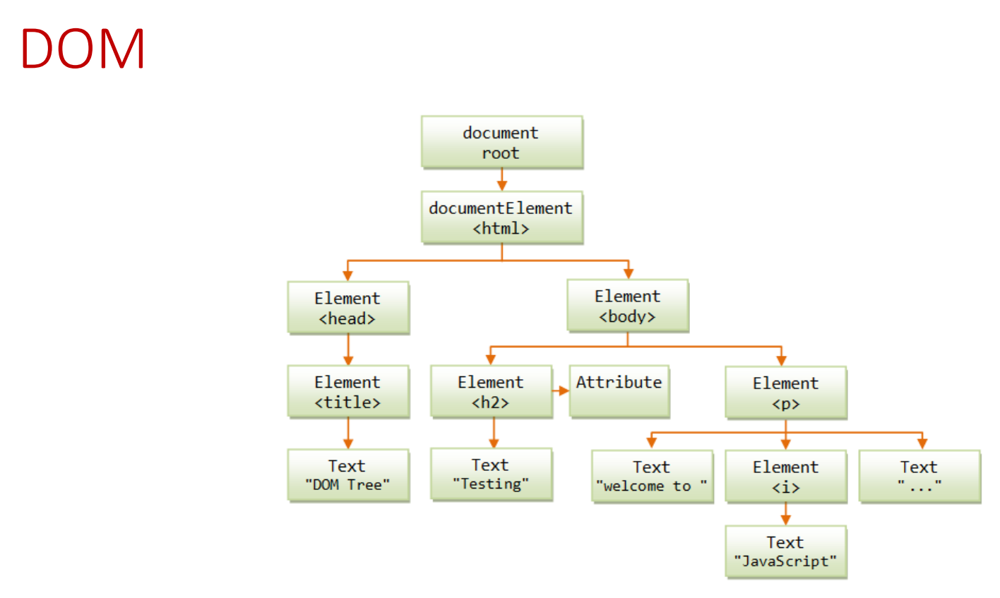
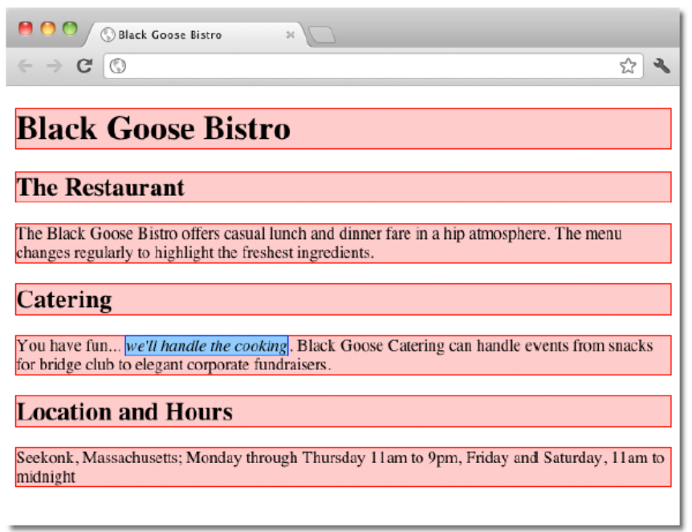
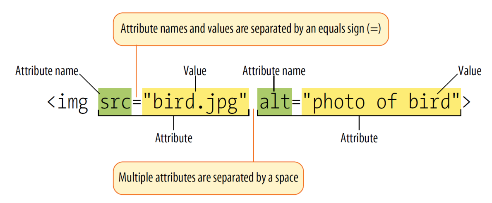

# HTML 기초

## 개요
- 마크업 작동 방식에 대한 이해(요소와 속성 포함)
- 브라우저가 HTML 문서를 해석하는 방법 이해
- HTML 문서의 기본 구조 학습


## 필요 도구
- **텍스트 에디터** - 코드 작성용
  - VS Code: https://code.visualstudio.com
- **웹 브라우저** - 결과물 확인용
  - Chrome: www.google.com/chrome


## HTML 요소(Elements)
- HTML 요소는 텍스트 소스에서 태그로 식별된다.
- 태그는 꺾쇠 괄호(< >) 내에 요소 이름으로 구성된다.
- 요소는 콘텐츠와 마크업(시작 태그와 종료 태그) 모두로 구성된다.
- 일부 요소는 정의상 비어 있다. 예를 들어 이미지를 페이지에 추가하는 데 사용되는 img 요소가 이에 해당한다.

## 기본 문서 구조(Basic Document Structure)
```html
<!DOCTYPE html>
<html lang="en">
<head>
    <meta charset="utf-8">
    <title>Title here</title>
</head>
<body>
    Page content goes here.
</body>
</html>
```
1. **문서 유형 선언(DOCTYPE)**: `<!DOCTYPE html>`
   - 이 문서를 HTML5 문서로 식별한다

2. **html 또는 루트 요소**: `<html lang="en">`
   - 문서의 모든 요소를 포함한다

3. **head 요소**: `<head>`
   - 문서에 대한 메타데이터를 포함한다

4. **meta 요소**: `<meta charset="utf-8">`
   - 문서 자체에 대한 정보를 제공한다 (이 경우 문자 인코딩)

5. **제목(title) 요소**: `<title>Title here</title>`
   - 브라우저 탭에 표시되는 페이지 제목

6. **본문(body) 요소**: `<body>Page content goes here.</body>`
   - 브라우저 창에 표시될 정보를 포함한다

## 텍스트 요소 식별하기(Identify Text Elements)

- HTML의 목적은 콘텐츠에 의미와 구조를 추가하는 것이다.
- 콘텐츠가 어떻게 보여야 하는지(표현)에 대한 지시사항을 제공하기 위한 것이 아니다.
- 콘텐츠를 마크업할 때 해당 콘텐츠를 가장 의미 있게 설명하는 HTML 요소를 선택하는 것이 중요하다.
- 이를 시맨틱 마크업(semantic markup)이라고 한다.
- 또한 마크업은 문서에 구조를 부여한다.
- 요소들이 서로 따르거나 중첩되는 방식은 요소 간의 관계를 생성한다.
- 이것을 개요(outline)로 생각할 수 있다 (기술적인 이름은 DOM, Document Object Model이다).



## 블록 요소와 인라인 요소(Block and inline elements)

### 블록 요소(Block elements)
- 브라우저는 블록 요소를 사각형 박스처럼 처리하여 페이지에 쌓아 올린다.
- 각 블록 요소는 새로운 줄에서 시작하며, 기본적으로 요소 위아래에 약간의 공간이 추가된다.
- 예시: 제목(headings), 단락(paragraphs) 등
- 블록 요소는 문서의 구조적인 요소로 사용된다.

### 인라인 요소(Inline elements)
- 인라인 요소는 새로운 줄을 시작하지 않고 텍스트 흐름을 따라간다.
- 예시: `<em>` 요소 (강조)
- 인라인 요소는 주로 텍스트의 일부를 스타일링하거나 특별한 의미를 부여하는 데 사용된다.




## 빈 요소(Empty elements)

- 일부 요소는 텍스트 내용을 갖지 않으며, 단순한 지시사항을 제공하는 용도로 사용된다.
- 이러한 요소를 '빈 요소'라고 한다.
- 빈 요소는 시작 태그만 가지며, 종료 태그가 없다.

### 주요 빈 요소
- **img**: 이미지 요소는 서버에서 이미지 파일을 가져와 텍스트 흐름 내에 삽입한다.
- **br**: 줄바꿈(line break) 요소는 텍스트에 줄바꿈을 삽입한다.
- **hr**: 주제 구분선(thematic break) 요소는 내용 사이에 구분선을 추가한다.
- **meta**: 문서에 대한 정보를 제공하지만 표시되는 내용에는 영향을 주지 않는다.

```
<p>1005 Gravenstein Highway North<br>Sebastopol, CA 95472</p>
```

## HTML 속성(Attributes)

- 속성은 요소를 명확히 하거나 수정하는 지시사항이다.
- 속성은 요소에 추가 정보를 제공한다.
- 속성은 이름과 값으로 구성되며, 등호(=)로 구분된다.
- 속성 값은 따옴표(" ")로 묶는다.
- 여러 속성은 공백으로 구분한다.

### img 요소의 속성
- `img` 요소에는 `src` 속성이 필수이며, 이미지 파일의 위치(URL)를 지정한다.
- `src`는 "source"의 약자이다.
- `alt` 속성은 이미지를 표시할 수 없을 때 대체 텍스트를 제공한다.

```

```


