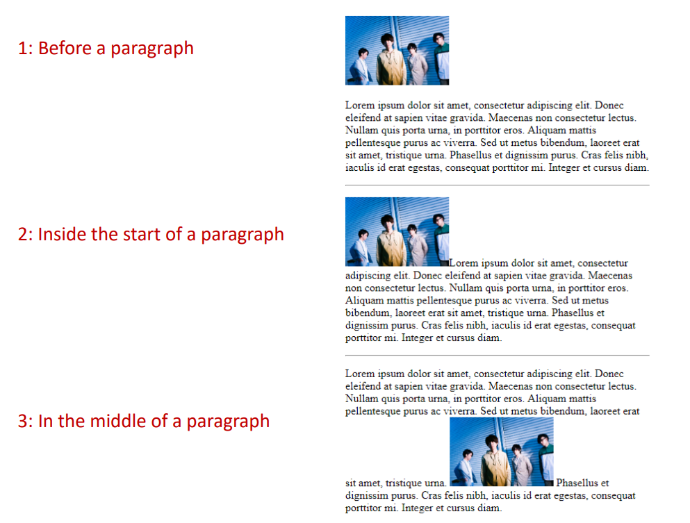
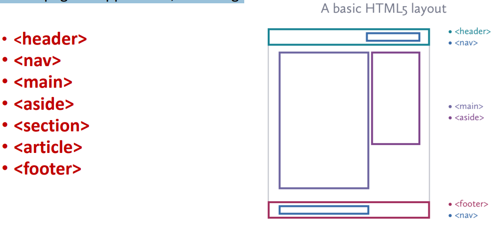

# 이미지 추가하기

## 기본 이미지 요소

이미지를 웹 페이지에 추가하는 방법이다:
- `` 요소를 사용하는 것이다
- 빈 요소(닫는 태그가 없음)이다
- 다음 속성들을 반드시 포함해야 하는 것이다:
  - **src**: 브라우저에게 이미지 파일의 위치를 알려주는 것이다
  - **alt**: 이미지에 대한 텍스트 설명을 제공하는 것이다
  - **title**: 사용자가 이미지 위에 마우스를 올렸을 때 표시되는 추가 정보이다

웹에서 가장 많이 사용되는 이미지 형식은 JPEG, PNG, GIF이다.

예시:
```html

```

## 이미지의 높이와 너비

이미지 크기를 지정하는 두 가지 속성이다:
- **height**: 이미지의 높이를 픽셀 단위로 지정하는 것이다
- **width**: 이미지의 너비를 픽셀 단위로 지정하는 것이다
```html

```

이미지 크기를 지정하는 이유:
- 이미지는 HTML 코드보다 로드 시간이 더 오래 걸리는 경우가 많다
- 브라우저가 아직 로딩 중인 이미지를 위한 적절한 공간을 남겨두면서 페이지의 텍스트를 렌더링할 수 있게 한다
- 최근에는 이미지 크기를 HTML보다는 CSS를 사용하여 지정하는 경우가 증가하고 있다

## 코드에서 이미지를 배치하는 위치

이미지가 코드에 배치되는 위치에 따라 표시 방식이 달라진다:

1. **단락 앞에 배치**
   - 이미지 다음에 단락이 새 줄에서 시작된다

2. **단락 시작 부분 안에 배치**
   - 텍스트의 첫 번째 줄이 이미지의 하단과 정렬된다

3. **단락 중간에 배치**
   - 이미지가 단락의 단어들 사이에 배치된다



# 링크 추가하기

## 기본 링크 요소

링크를 웹 페이지에 추가하는 방법이다:

- `<a>` 요소를 사용하는 것이다
- 사용자는 여는 `<a>` 태그와 닫는 `</a>` 태그 사이의 모든 것을 클릭할 수 있다
- `href` 속성을 사용하여 연결하려는 페이지를 지정하는 것이다

```html
<a href="http://www.imdb.com">IMDB</a>
```

## URL 유형

다른 웹사이트로 링크할 때 사용하는 것이다:
- `href` 속성의 값은 사이트의 전체 웹 주소가 된다
- 이를 **절대 URL**이라고 부른다

예시:
```html
<ul>
  <li><a href="http://www.empireonline.com">Empire</a></li>
  <li><a href="http://www.metacritic.com">Metacritic</a></li>
  <li><a href="http://www.rottentomatoes.com">Rotten Tomatoes</a></li>
  <li><a href="http://www.variety.com">Variety</a></li>
</ul>
```

결과 (목록 형태로 표시됨):
- Empire
- Metacritic
- Rotten Tomatoes
- Variety

## 내부 링크

같은 웹사이트 내의 다른 페이지로 링크하는 방법이다:
- **상대 URL**을 사용하는 것이다
- 전체 웹 주소를 포함하지 않고 현재 사이트를 기준으로 경로를 지정한다
- 도메인 이름 변경 시 모든 링크를 업데이트할 필요가 없다

예시:
```html
<a href="index.html">홈페이지</a>
<a href="about/about-us.html">소개</a>
<a href="../products.html">제품</a>
```

## 디렉토리 구조

큰 웹사이트에서는 코드를 체계적으로 관리하는 것이 중요하다:
- 사이트의 각 섹션별로 페이지를 별도 폴더에 배치하는 것이 좋다
- 웹사이트의 폴더는 때때로 '디렉토리'라고도 부른다

## 상대 URL 구조

상대 URL을 사용할 때 알아둬야 할 내용이다:

- **같은 폴더 내 파일**: 파일명만 지정한다
  ```html
  <a href="index.html">홈페이지</a>
  ```
- **하위 폴더 내 파일**: 하위 폴더명/파일명 형식으로 지정한다
  ```html
  <a href="about/about-us.html">소개</a>
  ```
- **상위 폴더 내 파일**: ../파일명 형식으로 지정한다
  ```html
  <a href="../products.html">제품</a>
  ```
- **다른 하위 폴더**: ../다른폴더명/파일명 형식으로 지정한다
  ```html
  <a href="../products/latest.html">최신 제품</a>
  ```

## 새 창에서 링크 열기

링크를 새 창(또는 새 탭)에서 열고 싶을 때는 `<a>` 태그에 `target` 속성을 사용한다.  
이때 속성 값으로는 **_blank**를 지정한다.

예시:
```html
<a href="http://www.imdb.com" target="_blank">
  Internet Movie Database
</a>
```
- 위와 같이 작성하면 링크가 새 창(또는 새 탭)에서 열린다.

## 페이지 내 특정 위치로 링크하기

웹페이지 내에서 특정 위치로 이동하는 링크를 만드는 방법은 다음과 같다.

### 1단계: 목적지 지정하기
- 목적지(이동할 위치)를 만들려면, 해당 요소에 `id` 속성을 사용해 고유한 이름을 부여한다.
- 이 고유 이름을 **fragment identifier(조각 식별자)**라고 한다.

### 2단계: 목적지로 링크하기
- `<a>` 요소의 `href` 속성에 `#`과 함께 해당 `id` 값을 지정하면 된다.
- `#` 기호는 fragment(조각) 링크임을 나타낸다.

#### 예시 코드
```html
<h1 id="startH">H</h1>
<p>... F | G | <a href="#startH">H</a> | I | J ...</p>
```
- 위 예시에서 "H" 링크를 클릭하면, 해당 페이지 내의 `<h1 id="startH">` 위치로 이동한다.

## 페이지 콘텐츠 구조화하기

HTML5에서는 웹페이지나 웹 애플리케이션의 각 영역에 의미를 부여하는 새로운 요소들이 도입되었다.  
이러한 요소들은 페이지의 구조를 더 명확하게 하고, 의미론적으로 구분할 수 있게 해준다.


## Header

- `header` 요소는 웹 페이지나 섹션, 또는 아티클의 시작 부분에 위치하는 소개 영역에 사용된다.
- 페이지나 섹션의 소개에 해당하는 모든 내용을 포함할 수 있다.
- 보통 사이트 로고, 제목, 내비게이션 등이 들어간다.

```html
<header>
  
  <h1>Nuts about Web Fonts</h1>
  <nav>
    <ul>
      <li><a href="">Home</a></li>
      <li><a href="">Blog</a></li>
      <li><a href="">Shop</a></li>
    </ul>
  </nav>
</header>
```

---

## Navigation

- `nav` 요소는 사이트의 주요 내비게이션 링크(메뉴)를 시맨틱하게 구분해준다.
- 사이트의 탐색을 위한 링크 목록을 담는다.

```html
<nav>
  <ul>
    <li><a href="">Serif</a></li>
    <li><a href="">Sans-serif</a></li>
    <li><a href="">Script</a></li>
    <li><a href="">Display</a></li>
    <li><a href="">Dingbats</a></li>
  </ul>
</nav>
```

---

## Main

- `main` 요소는 웹사이트의 주요 콘텐츠를 감싼다.
- 한 문서에 하나만 사용할 수 있다.
- 사이드바, 내비게이션, 저작권 정보, 사이트 로고, 검색 폼 등 반복되는 내용은 포함하지 않는다.

```html
<main>
  <!-- 웹사이트의 주요 콘텐츠 -->
</main>
```

## Aside

- `<aside>` 태그는 추가 정보를 나타낼 때 사용한다.
- aside의 내용은 주변 콘텐츠와 관련되어야 한다.
- 배경 정보, 관련 링크, 사이드바 등 문서의 부가적인 내용을 담을 수 있다.

```html
<aside>
  <h2>Web Font Resources</h2>
  <ul>
    <li><a href="http://typekit.com/">Typekit</a></li>
    <li><a href="http://www.google.com/webfonts">Google Fonts</a></li>
  </ul>
</aside>
```

---

## Footer

- `<footer>` 요소는 페이지, 섹션, 아티클의 끝에 위치하는 정보를 나타낸다.
- 작성자, 저작권 정보, 내비게이션 등이 들어갈 수 있다.

```html
<footer>
  <p><small>Copyright &copy;2012 Jennifer Robbins.</small></p>
  <nav>
    <ul>
      <li><a href="">Previous</a></li>
      <li><a href="">Next</a></li>
    </ul>
  </nav>
</footer>
```

---

## Section

- 긴 문서를 주제별로 구분할 때 `<section>` 요소를 사용한다.
- 신문 기사, 뉴스, 스포츠 등 다양한 주제별 구획에 적합하다.
- 여러 요소를 그룹화할 때 사용한다.

```html
<section>
  <h2>Typography Books</h2>
  <ul>
    <li>...</li>
  </ul>
</section>

<section>
  <h2>Online Tutorials</h2>
  <p>These are the best tutorials on the web.</p>
  <ul>
    <li>...</li>
  </ul>
</section>
```

---

## Article

- `<article>` 요소는 독립적으로 사용될 수 있는 콘텐츠(기사, 블로그 글, 댓글 등)에 사용한다.
- 긴 article은 여러 section으로 나눌 수 있고, section 안에 여러 article이 들어갈 수도 있다.

```html
<article>
  <h1>Get to Know Helvetica</h1>
  <section>
    <h2>History of Helvetica</h2>
    <p>...</p>
  </section>
  <section>
    <h2>Helvetica Today</h2>
    <p>...</p>
  </section>
</article>

<section id="essays">
  <article>
    <h1>A Fresh Look at Futura</h1>
    <p>...</p>
  </article>
  <article>
    <h1>Getting Personal with Humanist</h1>
    <p>...</p>
  </article>
</section>
```

## 인라인 요소(Inline elements)

- HTML5에서는 텍스트에 의미를 부여하는 **텍스트 수준 시맨틱 요소(text-level semantic elements)**를 제공한다.
- 인라인 요소(Inline elements)는 텍스트 흐름 내에 표시되며 줄바꿈을 일으키지 않는다.

---

## 강조 텍스트(Emphasized Text)

- `<em>` 요소는 문장에서 강조되어야 하는 부분을 나타낸다.
- `<em>`의 위치에 따라 문장의 의미가 달라질 수 있다.

```html
<p><em>Matt</em> is very smart.</p>
<p>Matt is <em>very</em> smart.</p>
```
- 첫 번째 문장은 **누가** 똑똑한지 강조, 두 번째 문장은 **얼마나** 똑똑한지 강조한다.

---

## 중요한 텍스트(Important Text)

- `<strong>` 요소는 단어나 구가 의미상으로 중요함을 나타낸다.

```html
<p>When checking out of the hotel, <strong>drop the keys in the red box by the front desk</strong>.</p>
```
- `<strong>`은 시각적으로 굵게(bold) 표시되며, 의미적으로도 중요함을 나타낸다.

---

## 짧은 인용구(Short quotations)

- `<q>` 요소는 텍스트 흐름 내에서 짧은 인용구를 표시할 때 사용한다.

```html
Matthew Carter says, <q>Our alphabet hasn't changed in eons.</q>
```
- 브라우저는 `<q>` 요소를 자동으로 따옴표로 감싸서 표시한다.

---

## 갱신된 요소(Renewed Elements)

- `b`, `i`, `u`, `s`, `small` 요소는 웹 초창기부터 사용된 인라인 스타일 요소이다.
  - `<b>`: 굵은 텍스트(키워드, 시각적 강조)
  - `<i>`: 이탤릭체(대체 음성, 외래어 등)
  - `<u>`: 밑줄(주석, 강조)
  - `<s>`: 취소선(잘못된 정보 등)
  - `<small>`: 작은 글씨(법적 문구, 저작권 등)
- HTML5에서는 이 요소들의 의미가 더 명확하게 정의되었다.

---

## 예시

```html
<b>...</b>      <!-- 키워드, 시각적 강조(굵게) -->
<i>...</i>      <!-- 대체 음성, 이탤릭체 -->
<s>...</s>      <!-- 잘못된 텍스트, 취소선 -->
<u>...</u>      <!-- 주석, 밑줄 -->
<small>...</small> <!-- 법적 문구, 작은 글씨 -->
```

## id와 class 속성

- `id` 속성은 문서 내에서 **고유한 식별자(unique identifier)**를 요소에 부여할 때 사용한다.  
  한 문서 내에서 한 번만 사용할 수 있다.
- `class` 속성은 요소들을 **개념적 그룹(conceptual groups)**으로 분류한다.  
  여러 요소가 같은 class 이름을 가질 수 있다.
- `id`와 `class` 속성은 HTML5에서 **모든 요소에 사용할 수 있다**.
- 같은 class를 가진 요소들은 한 번에 스타일을 적용하거나, 스크립트로 제어할 수 있다.

### 예시 코드

```html
<div id="ISBN0321127307" class="listing">
  <header>
    
    <p><cite>The Complete Manual of Typography</cite>, James Felici</p>
  </header>
  <p class="description">A combination of type history and examples of good and bad type.</p>
</div>

<div id="ISBN0881792063" class="listing">
  <header>
    
    <p><cite>The Elements of Typographic Style</cite>, Robert Bringhurst</p>
  </header>
  <p class="description">This lovely, well-written book is concerned foremost with creating beautiful typography.</p>
</div>
```

```html
<section id="main">
  <!-- main content elements here -->
</section>

<section id="news">
  <!-- news items here -->
</section>

<aside id="links">
  <!-- list of links here -->
</aside>
```

## Generic Elements (div와 span)

- 지금까지 소개한 요소들로도 콘텐츠를 정확히 설명할 수 없다면, HTML은 범용 요소인 `div`와 `span`을 제공한다.
- **div** 요소는 콘텐츠의 구획(division of content)을 나타내는 블록 레벨 요소이다.
- **span** 요소는 현재 별도의 텍스트 수준 시맨틱 요소가 없는 단어나 구에 의미를 부여할 때 사용하는 인라인 요소이다.
- 이 범용 요소들은 `id`와 `class` 속성을 통해 의미와 맥락을 부여받는다.
- 자체적인 시각적 특징은 없으며, CSS 스타일시트로 원하는 대로 꾸밀 수 있다.


## Divide it up with a div

- `div` 요소는 페이지에서 논리적으로 관련된 콘텐츠나 요소들을 그룹화할 때 사용한다.
- 이 요소로 묶인 내용은 CSS나 JavaScript로 하나의 단위로 다루거나 스타일을 적용할 수 있다.
- `div`는 블록 레벨 요소이며, 시맨틱 의미는 없지만 구조적 구분에 유용하다.

```html
<div class="listing">
  
  <p><cite>The Complete Manual of Typography</cite>, James Felici</p>
  <p>A combination of type history and examples of good and bad type design.</p>
</div>
```

- 여러 요소를 `div`로 감싸면, 해당 그룹만 별도로 스타일링하거나 스크립트로 제어할 수 있다.

## Get inline with span

- `span` 요소는 `div`와 비슷한 역할을 하지만, 인라인 요소로서 줄바꿈 없이 텍스트나 다른 인라인 요소를 감싼다.
- `span`은 텍스트 일부에만 스타일이나 의미를 부여하고 싶을 때 사용한다.
- 인라인 요소이므로 텍스트와 다른 인라인 요소만 포함할 수 있다.
- 예를 들어, 전화번호처럼 별도의 시맨틱 요소가 없는 경우 `span`에 class를 부여해 의미를 줄 수 있다.

```html
<ul>
  <li>John: <span class="tel">999.8282</span></li>
  <li>Paul: <span class="tel">888.4889</span></li>
  <li>George: <span class="tel">888.1628</span></li>
  <li>Ringo: <span class="tel">999.3220</span></li>
</ul>
```

## Special Characters (특수 문자)

- 저작권 기호(©)와 같은 일부 특수 문자는 표준 ASCII 문자 집합에 포함되어 있지 않다.
- `<`(less-than)과 같은 문자는 HTML에서 태그로 인식되므로, 문서 내에서 직접 입력하면 브라우저가 태그로 해석한다.
- *이런 특수 문자는 반드시 이스케이프(escaping)해서 사용해야 한다.*
  - 이스케이프란, 해당 문자를 직접 입력하는 대신 **숫자 엔티티(numeric entity)** 또는 **이름 엔티티(named entity)**로 표기하는 것.
- 특수 문자를 나타내는 방법은 두 가지:
  1. **숫자 엔티티**: 예) `&#169;`
  2. **이름 엔티티**: 예) `&copy;`

### 자주 쓰는 특수 문자 예시

| 문자 | 설명                | 이름 엔티티   | 숫자 엔티티  |
|------|---------------------|--------------|-------------|
|   ©  | Copyright           | `&copy;`     | `&#169;`    |
|   ™  | Trademark           | `&trade;`    | `&#8482;`   |
|   &  | Ampersand           | `&amp;`      | `&#38;`     |
|   <  | Less-than           | `&lt;`       | `&#60;`     |
|   >  | Greater-than        | `&gt;`       | `&#62;`     |
|   €  | Euro                | `&euro;`     | `&#8364;`   |
|   £  | Pound               | `&pound;`    | `&#163;`    |
|   ¥  | Yen                 | `&yen;`      | `&#165;`    |
|   ®  | Registered trademark| `&reg;`      | `&#174;`    |
|   ’  | Apostrophe          | `&apos;`     | `&#39;`     |
|   (공백) | Nonbreaking space | `&nbsp;`     | `&#160;`    |

#### 예시 코드

```html
<p>All content copyright &copy; 2012, Jennifer Robbins</p>
```

## Figures

- `<figure>` 요소는 독립적인 콘텐츠(이미지, 다이어그램, 코드 조각 등)를 나타내며, 보통 `<figcaption>`(설명)과 함께 사용된다.
- `<figure>`는 문서의 본문 흐름과 독립적으로 이동하거나 별도의 부록 등으로 옮겨도 의미가 유지된다.
- 주로 이미지, 일러스트, 표, 코드 등과 그에 대한 설명을 묶을 때 사용한다.

### 예시

```html
<!-- 단순 figure -->
<figure>
  
</figure>

<!-- figcaption(설명) 포함 -->
<figure>
  
  <figcaption>MDN Logo</figcaption>
</figure>
```

- 위 예시처럼 `<figcaption>`을 사용하면 그림에 대한 설명(캡션)을 제공할 수 있다.